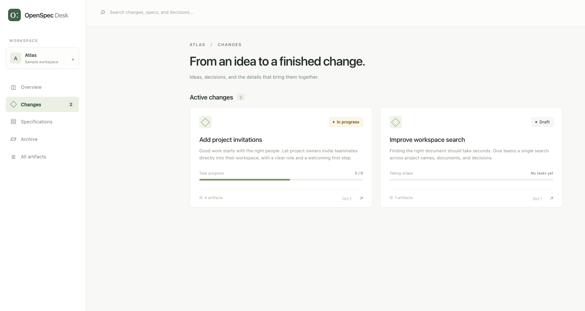

A read-only dashboard for OpenSpec artifacts. It reads the Markdown and YAML in a repository's `openspec/` folder and shows changes, specifications, task progress, and archives in the browser.



There are two ways to use it:

- **Locally:** one command serves the dashboard for your working copy.
- **As a static site:** one command in CI writes a folder of plain files. Host it behind your company's sign-in, and everyone can read the specs without a GitHub account.

Both need only Node.js 22 or newer. The OpenSpec CLI is not required.

## Run locally

From a repository that contains an `openspec/` folder:

```sh
npx openspec-desk
```

Open **http://127.0.0.1:4310**. To read another repository, pass its path:

```sh
npx openspec-desk ~/Projects/my-app
```

| Option            | Meaning                                                                           |
| ----------------- | --------------------------------------------------------------------------------- |
| `path`            | Repository root or the `openspec/` folder itself. Default: the current folder.    |
| `--port <number>` | Port for the local server. Default: the `PORT` environment variable, then `4310`. |
| `--demo`          | Open the bundled sample workspace instead of a path.                              |

Use **Refresh workspace** after files change on disk. The current document remains selected. The app never writes to the repository.

## Publish from CI

```sh
npx openspec-desk export --out site
```

This writes the dashboard and a `workspace.json` snapshot of the specs into `site/`. The folder works on any static host and under any URL path. `export` accepts the same `path` and `--demo` options as the local command; `--out` defaults to `site`.

### GitHub Pages

Add this workflow to the repository that holds the specs, and set **Settings → Pages → Source** to **GitHub Actions**:

```yaml
name: Publish specs
on:
  push:
    branches: [main]
    paths: ['openspec/**']
  workflow_dispatch:
permissions:
  contents: read
  pages: write
  id-token: write
concurrency:
  group: pages
  cancel-in-progress: true
jobs:
  publish:
    runs-on: ubuntu-latest
    environment:
      name: github-pages
      url: ${{ steps.deploy.outputs.page_url }}
    steps:
      - uses: actions/checkout@v7
      - uses: actions/setup-node@v7
        with:
          node-version: 22
      - run: npx --yes openspec-desk export --out site
      - uses: actions/upload-pages-artifact@v5
        with:
          path: site
      - id: deploy
        uses: actions/deploy-pages@v5
```

GitHub Pages sites are public unless the organization uses private Pages, which requires GitHub Enterprise Cloud. For specs that must stay internal on other plans, use a host that sits behind your sign-in.

In GitHub Actions the export records the repository, branch, and commit. The dashboard shows them and links each document to its source on GitHub.

### Other hosts

Upload the `site/` folder. Azure Static Web Apps, Cloudflare Pages with Cloudflare Access, and any internal web server behind single sign-on all work. Access control belongs to the host; the site contains no sign-in code.

## Reading

- Overview of active changes, published specifications, task counts, and archives.
- Change pages group proposal, design, tasks, nested delta specs, and extra artifacts.
- Full-text search across Markdown and YAML, including archived changes.
- Markdown reader with an outline, internal document links, tables, code blocks, and disabled task checkboxes.
- Source view for every artifact; YAML configuration and metadata are also browsable.
- Task progress excludes fenced examples. Published specs are only files under `openspec/specs/**/spec.md`; proposed specs remain under their change.

The sample workspace is fictional.

## Development

Requires Node.js 22.22.3 or newer (Angular 22) and npm.

```sh
npm ci
npm start        # builds, then serves the sample workspace on port 4310
```

To serve a repository of your own from a clone, run `npm run build` and then `node dist/cli/main.js ~/Projects/my-app`.

For live frontend development, keep `npm start` running and start the Angular dev server in a second terminal:

```sh
npm run dev      # http://127.0.0.1:4200, reads the workspace from port 4310
```

### Layout

| Path                     | Contents                                                                            |
| ------------------------ | ----------------------------------------------------------------------------------- |
| `cli/`                   | The command: folder reader, parser, local server, and export. Node-only TypeScript. |
| `src/`                   | The Angular dashboard. It loads `workspace.json` and renders it.                    |
| `demo/openspec/`         | The sample workspace, also used by the tests.                                       |
| `dist/app/`, `dist/cli/` | Build output. These two folders and `demo/` are what the npm package ships.         |

The reader and parser turn the folder into the model in `cli/workspace.model.ts`. The local server parses again on every `workspace.json` request; the export parses once and writes the file.

### Tests

```sh
npm test                          # type-checks and unit-tests the CLI
npm run build
npx playwright install chromium   # once
npm run test:ui                   # browser tests against the built package
```

The unit tests cover parsing, folder boundaries and size limits, the local server's request checks, and the export. The browser tests cover reading, search, links, refresh, the phone layout, and an exported site served under a subpath by a host without fallback pages.

### Release

`npm publish` builds the package first (`prepack`).

Angular disk caching is disabled in this project because the installed LMDB native addon crashed on this Mac. This does not affect the running app.

## Current boundaries

- Read-only: it does not clone, commit, push, edit artifacts, or run implementation tasks.
- One workspace per local server. An exported site is one snapshot; it does not offer other branches or commits.
- Refresh is manual. A published site updates when CI runs again.
- An exported site has no modification dates, because file times in a CI checkout carry no meaning. It shows the published revision instead.
- Reads custom documents and schemas, but task progress uses a change's `tasks.md`. Progress describes checked tasks, not OpenSpec workflow readiness or implementation correctness.
- External OpenSpec stores are not resolved automatically. Open the store repository directly.
- Markdown images are represented by their alt text, raw HTML is escaped, and Mermaid is shown as code. External images are not fetched.
- Symbolic links inside the `openspec` folder are skipped. Limits: 2,000 artifacts, 2 MB per artifact, 20 MB total, and 20 nested folder levels.
- The local server binds to loopback and rejects foreign hosts, cross-site requests, and anything other than reads.
- Revision details and source links are filled in only when the export runs in GitHub Actions.

OpenSpec references: [CLI](https://openspec.dev/docs/cli), [custom schemas](https://openspec.dev/docs/customize-schemas).

## License

[MIT](LICENSE)
