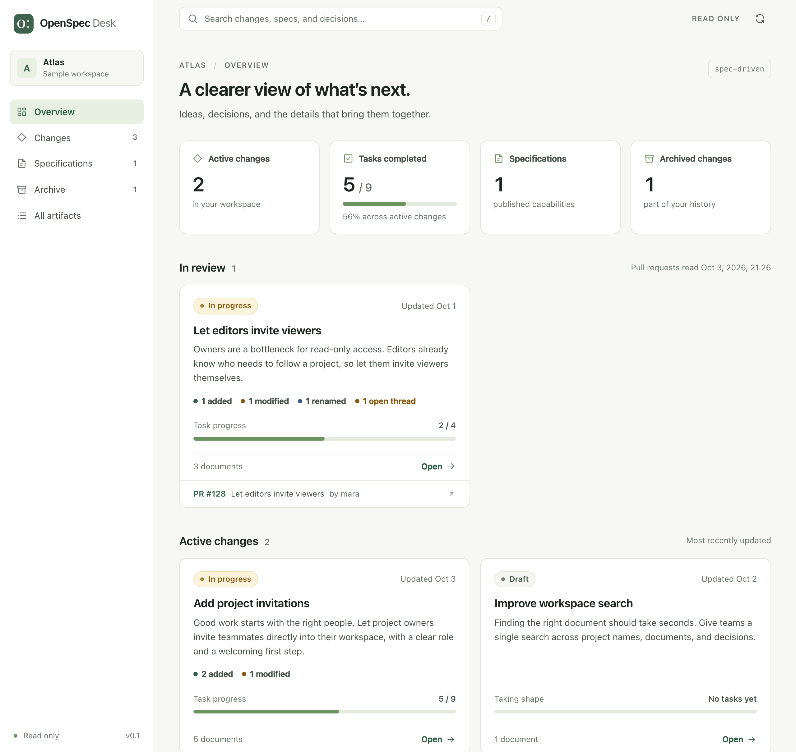
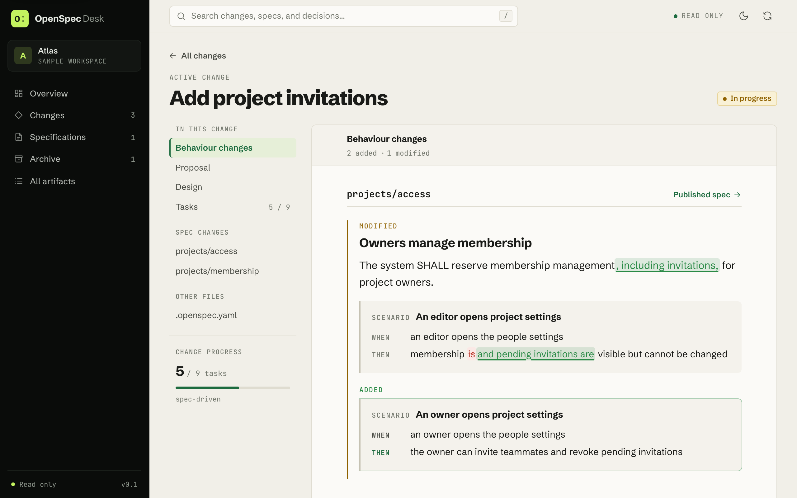
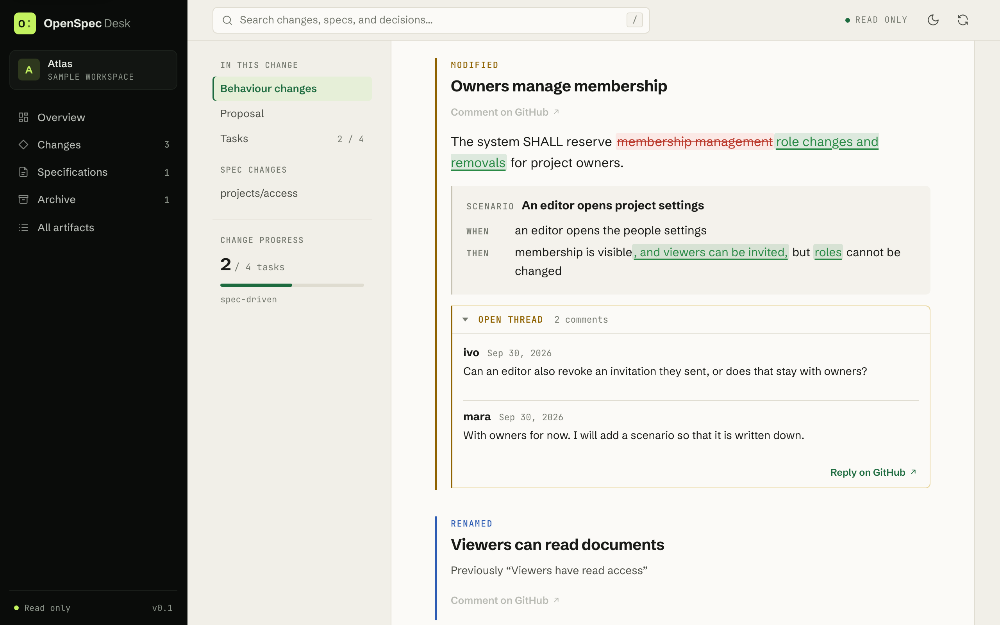
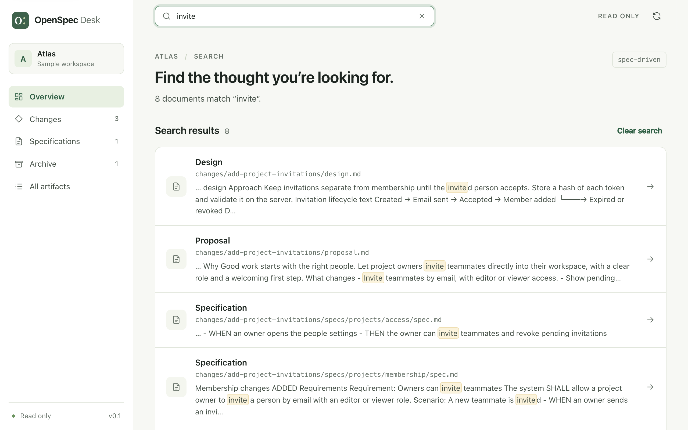
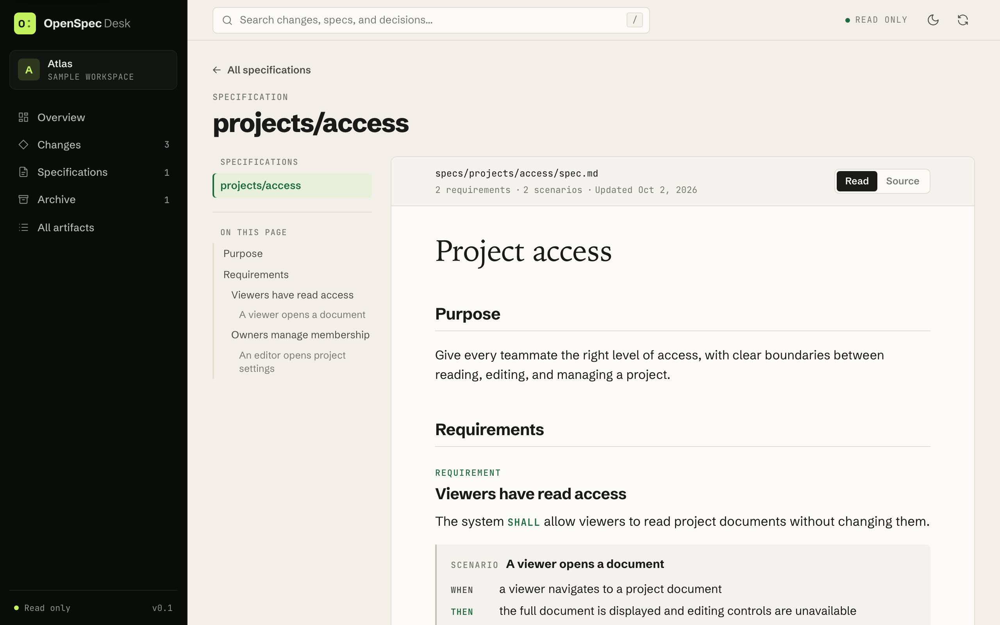

# OpenSpec Desk

[](https://www.npmjs.com/package/openspec-desk)
[](LICENSE)

A read-only dashboard for [OpenSpec](https://openspec.dev) artifacts. It reads the Markdown and YAML in a repository's `openspec/` folder and shows changes, specifications, task progress, and archives in the browser.

Try the **[live demo](https://openspec-desk.vercel.app/)**, or open the same sample workspace locally:

```sh
npx openspec-desk --demo
```



There are two ways to use it:

- **Locally:** one command serves the dashboard for your working copy.
- **As a static site:** one command in CI writes a folder of plain files. Host it behind your company's sign-in, and everyone can read the specs without a GitHub account.

Both need only Node.js 22 or newer. The OpenSpec CLI is not required.

## Features

The overview, in the picture at the top, lists the active changes, the published specifications, the task counts, and the archives. Each feature below links to its page in the live demo.

### Behaviour changes

Each active change shows what it does to the published specs: its delta specs read as added, modified, removed, and renamed requirements, grouped by capability and compared with the published spec. A modified requirement shows the removed and the added words, scenario by scenario. A note marks a requirement that the published spec lacks or already has. [See it in the demo](https://openspec-desk.vercel.app/#/change?id=changes%2Fadd-project-invitations).



The same page groups the proposal, design, tasks, nested delta specs, and extra artifacts of the change.

### Changes in review

When the export read pull requests (see [Pull requests](#pull-requests)), an "In review" section lists the changes of open pull requests apart from those of the published branch, each with its pull request and the time the pull requests were read. A change that its pull request has already archived still counts as in review. Its behaviour changes are compared with the published branch.

Review threads are shown read-only: a thread on a requirement with that requirement, the others under "Discussion". Each change states its unresolved threads ("3 open threads"), resolved threads are collapsed, and every thread links to GitHub for replies. [See it in the demo](https://openspec-desk.vercel.app/#/change?id=.pulls%2F128%2Fchanges%2Flet-editors-invite-viewers).



To start a discussion, use "Comment on GitHub" below a requirement of a change in review. It opens the pull request on GitHub in a new tab, where you select a line of the spec in Files changed, type your feedback, and post a single comment. A "How to comment" section on the page sums this up. Commenting needs a GitHub account with read access to the repository. The link goes as close to the requirement as the exported data allows:

- A line within the requirement, when the pull request adds the spec, or when a current review thread sits within the requirement.
- Otherwise the spec's diff, and the page names the requirement to look for.
- When the spec is not in the pull request's diff, or the site was exported by a version that did not record diff locations, the pull request's Files changed. The page then shows the spec's path and the requirement.

Removed and renamed requirements link to their delta spec, never to the published spec. Locations are those of the export, so they may have moved when the pull request has newer commits. A new thread shows up on the site after the next CI run. The demo's pull request is fictional, so its links are disabled.

### Search

Full-text search across Markdown and YAML, including archived changes and pull request documents. Try it in the search box of [the demo](https://openspec-desk.vercel.app/).



### Reader

A Markdown reader with an outline, internal document links, tables, code blocks, and disabled task checkboxes. Every artifact also has a source view; YAML configuration and metadata are browsable too. [See it in the demo](https://openspec-desk.vercel.app/#/artifact?path=specs%2Fprojects%2Faccess%2Fspec.md).



Task progress excludes fenced examples. Published specs are only files under `openspec/specs/**/spec.md`; proposed specs remain under their change.

The sample workspace is fictional, and so is its pull request. It is bundled with the package; the sample never contacts GitHub.

## Run locally

From a repository that contains an `openspec/` folder:

```sh
npx openspec-desk
```

Open **http://127.0.0.1:4310**. To read another repository, pass its path:

```sh
npx openspec-desk ~/Projects/my-app
```

| Option            | Meaning                                                                           |
| ----------------- | --------------------------------------------------------------------------------- |
| `path`            | Repository root or the `openspec/` folder itself. Default: the current folder.    |
| `--port <number>` | Port for the local server. Default: the `PORT` environment variable, then `4310`. |
| `--demo`          | Open the bundled sample workspace instead of a path.                              |

Use **Refresh workspace** after files change on disk. The current document remains selected. The app never writes to the repository.

## Publish from CI

```sh
npx openspec-desk export --out site
```

This writes the dashboard and a `workspace.json` snapshot of the specs into `site/`. The folder works on any static host and under any URL path.

```text
openspec-desk export [path] [--out <folder>] [--pull-requests] [--demo]
```

| Option            | Meaning                                                                                           |
| ----------------- | ------------------------------------------------------------------------------------------------- |
| `path`            | Repository root or the `openspec/` folder itself. Default: the current folder.                    |
| `--out <folder>`  | Folder for the exported site. Default: `site`.                                                    |
| `--pull-requests` | Include the open pull requests that change the specs. See [Pull requests](#pull-requests).        |
| `--demo`          | Export the bundled sample workspace instead of a path. Cannot be combined with `--pull-requests`. |

In GitHub Actions the export records the repository, branch, and commit. The dashboard shows them and links each document to its source on GitHub.

### Pull requests

With `--pull-requests` the export also asks GitHub for the open pull requests of the repository, so the site shows the changes that are still in review. Without the option the export makes no request to GitHub.

It reads:

- The open pull requests that target the exported branch.
- The changes of each pull request. A change counts when the pull request adds to or modifies its folder, `changes/<name>/`. It also counts when the pull request has already archived it under `changes/archive/<name>/`. The documents are read at the head commit of the pull request.
- The review threads on those documents, and which of the documents the pull request changes, for the comment links.

The option works in a GitHub Actions workflow. It needs these environment variables:

- `GITHUB_TOKEN`, or else `GH_TOKEN`: a token that can read the contents and the pull requests of the repository. In a workflow that is `${{ github.token }}` with the permissions `contents: read` and `pull-requests: read`.
- `GITHUB_ACTIONS`, `GITHUB_REPOSITORY`, `GITHUB_REF_NAME`, and `GITHUB_SHA`: the repository, the exported branch, and its commit. GitHub Actions sets them.
- `GITHUB_GRAPHQL_URL`: the API endpoint. GitHub Actions sets it; without it the export uses `https://api.github.com/graphql`.

A failed read fails the export. When the token or a variable is missing, or a request to GitHub fails, the export exits with an error that names the missing variable or gives GitHub's answer, and it writes nothing. The workflow stops before it deploys, so the previously published site stays.

Documents from pull requests follow the rules for documents on disk: only Markdown and YAML files, symbolic links are skipped, and a document may be at most 2 MB. The site holds at most 2,000 documents and 20 MB in total. Pull requests are added from the most recently updated one on; the first one that would exceed these totals is left out, together with all that follow. At most the 200 most recently updated pull requests are read. Pull requests from forks are skipped. The dashboard reports everything that was left out as a warning and still shows the rest.

With `--pull-requests`, unmerged proposals, review comments, and the GitHub logins of their authors become visible to everyone who can reach the site.

The option is tested against github.com only. GitHub Enterprise Server is untested.

### GitHub Pages

Add this workflow to the repository that holds the specs, and set **Settings → Pages → Source** to **GitHub Actions**:

```yaml
name: Publish specs
on:
  push:
    branches: [main]
    paths: ['openspec/**']
  pull_request_target:
    branches: [main]
    types: [opened, synchronize, reopened, closed, edited, ready_for_review, converted_to_draft]
    paths: ['openspec/**']
  schedule:
    - cron: '*/30 * * * *'
  workflow_dispatch:
permissions:
  contents: read
  pull-requests: read
  pages: write
  id-token: write
concurrency:
  group: pages
  cancel-in-progress: true
jobs:
  publish:
    runs-on: ubuntu-latest
    environment:
      name: github-pages
      url: ${{ steps.deploy.outputs.page_url }}
    steps:
      - uses: actions/checkout@v7
      - uses: actions/setup-node@v7
        with:
          node-version: 22
      - run: npx --yes openspec-desk export --pull-requests --out site
        env:
          GITHUB_TOKEN: ${{ github.token }}
      - uses: actions/upload-pages-artifact@v5
        with:
          path: site
      - id: deploy
        uses: actions/deploy-pages@v5
```

The `push` trigger publishes the specs when they change on `main`. The other two triggers keep the pull requests on the site up to date:

- `pull_request_target` runs when a pull request that targets `main` and touches `openspec/` is opened, updated, edited, or closed, or when its draft state changes. Unlike `pull_request`, it always runs the workflow of the default branch, with the default branch checked out. So the `github-pages` environment accepts the deployment, and no code from the pull request runs.
- `schedule` picks up new review threads. Review comment events cannot deploy to the `github-pages` environment, so the site is rebuilt every 30 minutes instead.

Both triggers export the default branch, so the workflow assumes that `main` is the default branch. Use its name in both places if it differs.

**Keep the default checkout.** A `pull_request_target` job runs with the permissions of the workflow, also for a pull request from a fork. The job must never check out the branch of a pull request, and never install, build, or run anything that comes from one. The export does not need it: it reads pull request documents through the API, as data.

GitHub Pages sites are public unless the organization uses private Pages, which requires GitHub Enterprise Cloud. For specs that must stay internal on other plans, use a host that sits behind your sign-in.

### Other hosts

Upload the `site/` folder. Azure Static Web Apps, Cloudflare Pages with Cloudflare Access, and any internal web server behind single sign-on all work. Access control belongs to the host; the site contains no sign-in code.

A workflow without `--pull-requests` still works, on GitHub Pages and on any other host: the `push` trigger alone, without the `pull-requests: read` permission and without a token. The site then shows the exported branch alone.

## Development

Requires Node.js 22.22.3 or newer (Angular 22) and npm.

```sh
npm ci
npm start        # builds, then serves the sample workspace on port 4310
```

To serve a repository of your own from a clone, run `npm run build` and then `node dist/cli/main.js ~/Projects/my-app`.

For live frontend development, keep `npm start` running and start the Angular dev server in a second terminal:

```sh
npm run dev      # http://127.0.0.1:4200, reads the workspace from port 4310
```

### Layout

| Path                     | Contents                                                                            |
| ------------------------ | ----------------------------------------------------------------------------------- |
| `cli/`                   | The command: folder reader, parser, local server, and export. Node-only TypeScript. |
| `src/`                   | The Angular dashboard. It loads `workspace.json` and renders it.                    |
| `demo/openspec/`         | The sample workspace, also used by the tests.                                       |
| `dist/app/`, `dist/cli/` | Build output. These two folders and `demo/` are what the npm package ships.         |

The reader and parser turn the folder into the model in `cli/workspace.model.ts`. The local server parses again on every `workspace.json` request; the export parses once and writes the file.

### Tests

```sh
npm test                          # type-checks and unit-tests the CLI
npm run build
npx playwright install chromium   # once
npm run test:ui                   # browser tests against the built package
```

The unit tests cover parsing, folder boundaries and size limits, the local server's request checks, and the export. The browser tests cover reading, search, links, refresh, the phone layout, and an exported site served under a subpath by a host without fallback pages.

### Screenshots

```sh
npm run build
npm run screenshots               # writes the pictures of this README to docs/screenshots/
```

The pictures come from the sample workspace in the built package. Take them again after a change to the interface.

### Release

`npm publish` builds the package first (`prepack`).

Angular disk caching is disabled in this project because the installed LMDB native addon crashed on this Mac. This does not affect the running app.

## Current boundaries

- Read-only: it does not clone, commit, push, comment, edit artifacts, or run implementation tasks. "Comment on GitHub" and "Reply on GitHub" only open GitHub, where you sign in and post.
- One workspace per local server. An exported site is one snapshot of one branch, with the open pull requests that target it when `--pull-requests` is given; it does not offer other branches or commits.
- Refresh is manual. A published site, including its pull requests and review threads, updates when CI runs again.
- An exported site has no modification dates, because file times in a CI checkout carry no meaning. It shows the published revision instead; a change in review shows when its pull request was last updated.
- Pull requests are read from GitHub during an export only; the local server never contacts GitHub. Pull requests from forks and pull requests that target another branch are not shown, and neither is a spec that a pull request edits without a change folder.
- Only review threads on the documents of a change are shown: not the pull request's conversation, and not threads on code. A thread shows at most 30 comments and links to GitHub for the rest. Avatars are not fetched.
- Behaviour changes follow the OpenSpec delta format (`## ADDED|MODIFIED|REMOVED|RENAMED Requirements`). Archived changes have none, because the text they replaced is no longer in the published spec. Deltas are not validated; `openspec validate` does that.
- Reads custom documents and schemas, but task progress uses a change's `tasks.md`. Progress describes checked tasks, not OpenSpec workflow readiness or implementation correctness.
- External OpenSpec stores are not resolved automatically. Open the store repository directly.
- Markdown images are represented by their alt text, raw HTML is escaped, and Mermaid is shown as code. External images are not fetched.
- Symbolic links inside the `openspec` folder are skipped. Limits: 2,000 artifacts, 2 MB per artifact, 20 MB total, and 20 nested folder levels.
- The local server binds to loopback and rejects foreign hosts, cross-site requests, and anything other than reads.
- Revision details and source links are filled in only when the export runs in GitHub Actions.

OpenSpec references: [CLI](https://openspec.dev/docs/cli), [custom schemas](https://openspec.dev/docs/customize-schemas).

## License

[MIT](LICENSE)
