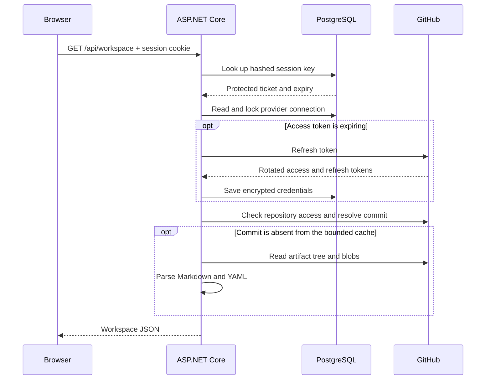

# C# backend guide

The backend is one ASP.NET Core 10 application. Angular calls the same `/api/*` endpoints in local and hosted modes. Production serves the built Angular files and API from one origin.

## Where to start

Read these in order:

1. [Program.cs](OpenSpec.Api/Program.cs): the composition root. It registers services in the dependency-injection container, configures middleware, checks migrations, and starts the HTTP server.
2. [DashboardEndpoints.cs](OpenSpec.Api/Api/DashboardEndpoints.cs): Minimal API routes. Handlers collect inputs, call services, and return responses. Hosted repository routes require authentication.
3. [WorkspaceParser.cs](OpenSpec.Api/Workspaces/WorkspaceParser.cs): application logic shared by local and GitHub readers. Markdig parses Markdown; YamlDotNet reads configuration. The result uses typed records from `Models.cs`.
4. [GitHubRepositoryService.cs](OpenSpec.Api/GitHub/GitHubRepositoryService.cs): external repository reads. It fixes a branch to one commit and checks the viewer's permissions before using cached content.
5. [DashboardDbContext.cs](OpenSpec.Api/Data/DashboardDbContext.cs): Entity Framework Core's database model. Npgsql translates EF operations to PostgreSQL.
6. [AuthenticationRegistration.cs](OpenSpec.Api/Auth/AuthenticationRegistration.cs): framework OAuth and cookie authentication, plus the application hooks that save GitHub connections.

## A hosted request



The PostgreSQL lock is released when the connection transaction commits. GitHub tokens never enter frontend responses or authentication tickets. The browser's cookie holds a protected session reference. Signing out deletes the session record; other devices keep their own sessions.

## C# conventions used here

- **Dependency injection:** constructor parameters declare dependencies. The framework creates services and manages their lifetimes. The parser and cache are shared singletons; database contexts and connection services are scoped to a request. `PostgresTicketStore` uses a context factory because cookie options outlive requests.
- **Async I/O:** network, database, and filesystem calls return `Task` and use `await`. Request cancellation flows through the readers and GitHub calls.
- **Records for response data:** DTOs describe the JSON contract. Database entities remain separate classes. ASP.NET serializes property names to camel case for Angular.
- **Nullable reference types:** `string?` means a value may be absent. Compiler warnings are treated as errors. Fix null handling instead of disabling the checks.
- **Framework authentication:** ASP.NET handles OAuth correlation, state encryption, PKCE, and cookie validation. An `ITicketStore` implementation puts session tickets in PostgreSQL. An extra database record makes each OAuth attempt expire and complete only once across replicas.
- **Data Protection:** purpose-specific protectors separate session tickets from each user's GitHub credentials. The shared key ring is stored in PostgreSQL; an external certificate encrypts the keys at rest. Keep the certificate private and backed up.
- **EF Core directly:** the small API uses its `DbContext` without a generic repository layer. Transactions are explicit where token rotation and account creation require coordination. SQL is parameterized.
- **Boundaries:** middleware checks host, origin, HTTP method, and the frontend request header. Local file reads reject traversal and skip links inside the artifact tree. GitHub reads have timeouts, response limits, and bounded concurrency.

## Commands

From the repository root:

```sh
dotnet restore OpenSpec.slnx
dotnet build OpenSpec.slnx
npm test
dotnet format OpenSpec.slnx --verify-no-changes
```

Run `npm run dev` and `npm run serve:api` in separate terminals for frontend development. Use your IDE's C# debugger on `OpenSpec.Api` to step through a route. Local mode works without GitHub or PostgreSQL.

For database changes:

```sh
dotnet tool restore
dotnet ef migrations add DescribeTheChange --project backend/OpenSpec.Api --output-dir Data/Migrations
npm run db:migrate
```

Commit the generated migration and model snapshot together. The migration command reads `.env`; `dotnet ef` uses `ConnectionStrings__Dashboard` from the shell when it needs database access. Migration scaffolding itself does not need GitHub credentials. The running app checks for pending migrations and never applies them automatically.

## Tests

`OpenSpec.Api.Tests` contains xUnit parser/reader tests and HTTP tests using `WebApplicationFactory`. PostgreSQL tests use the real provider, SQL migrations, data protection, and authentication middleware. They create a unique schema per test in the database identified by `TEST_DATABASE_CONNECTION`, then remove it.

```sh
export TEST_DATABASE_CONNECTION='Host=localhost;Database=openspec_test;Username=openspec;Password=...'
npm run test:db
npm run build
dotnet build OpenSpec.slnx
npm run test:ui
```

`OpenSpec.BrowserHost` starts a test-only Kestrel server with fake GitHub responses and a temporary PostgreSQL schema for Playwright. It is excluded from the production image. A live GitHub OAuth check still requires a registered GitHub App.

References: [Minimal APIs](https://learn.microsoft.com/en-us/aspnet/core/fundamentals/minimal-apis/overview?view=aspnetcore-10.0), [dependency injection](https://learn.microsoft.com/en-us/aspnet/core/fundamentals/dependency-injection?view=aspnetcore-10.0), [cookie authentication](https://learn.microsoft.com/en-us/aspnet/core/security/authentication/cookie?view=aspnetcore-10.0), [data protection](https://learn.microsoft.com/en-us/aspnet/core/security/data-protection/configuration/overview?view=aspnetcore-10.0), [Npgsql EF Core](https://www.npgsql.org/efcore/).
